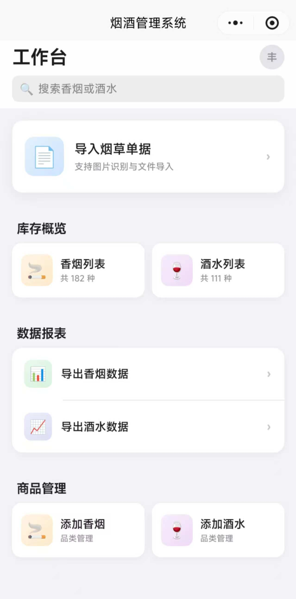
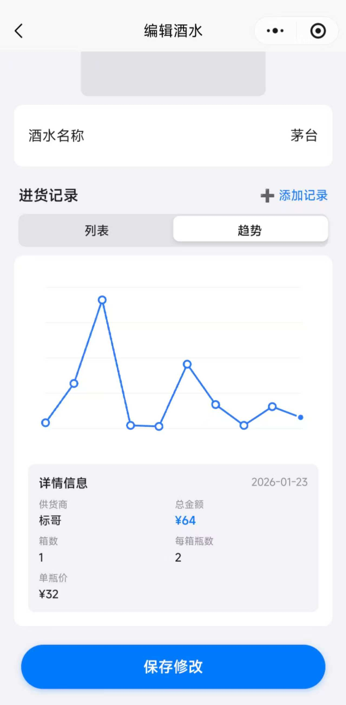
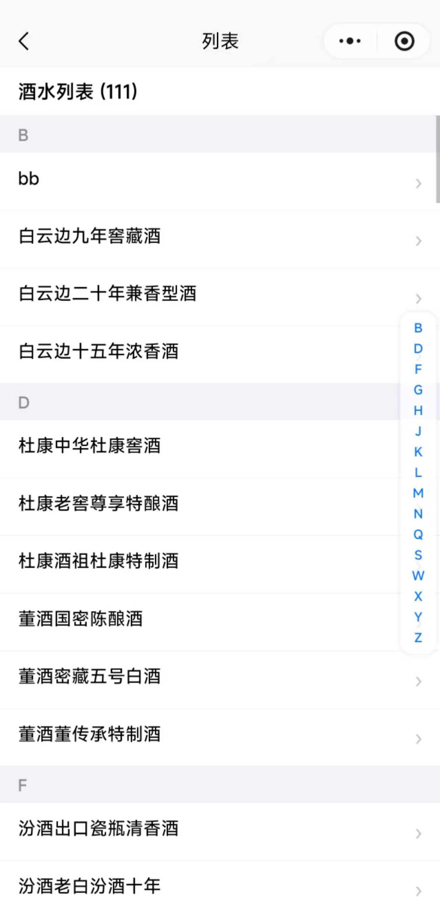
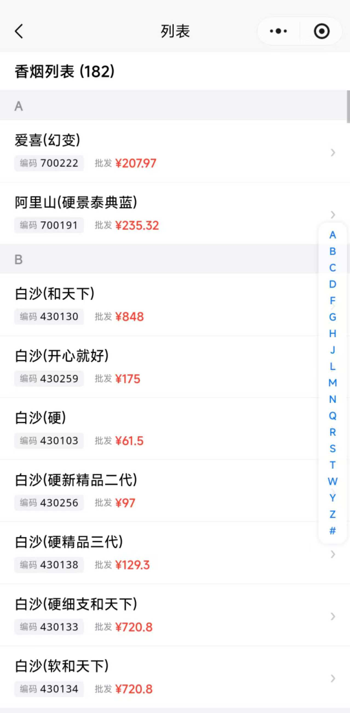

# 烟酒管理系统 (Tobacco & Alcohol Management System)

## 📋 项目概述

这是为家人开发的轻量小程序，开发完成后便顺手做了开源分享。虽功能尚属简约，但希望能为有同类需求的朋友提供一点参考与帮助。(Tobacco & Alcohol Management System 是基于 UNI-APP 框架开发的烟酒管理系统，可实现香烟、酒水的库存管理、数据导入及详情查看等核心功能，支持小程序、App 等多端部署，后端采用支付宝云函数与数据库搭建。

**应用名称**: 烟酒管理系统  
**项目版本**: 1.0.0  
**开发框架**: UNI-APP  
**后端服务**: 支付宝云（uniCloud-alipay）

---

## 📸 核心界面预览

以下是应用在不同页面的实际运行截图：

   

 

---

## ✨ 核心功能

### 1. **用户管理**
   - 用户注册功能
   - 用户登录功能
   - 基于 uni-id 的身份认证

### 2. **香烟管理** 
   - 香烟列表展示
   - 香烟详情查看
   - 单据导入功能（支持Excel等文件导入）
   - 香烟库存管理

### 3. **酒水管理**
   - 酒水列表展示
   - 酒水详情查看
   - 酒水历史记录追踪
   - 酒水库存管理

### 4. **通用功能**
   - 统一的列表展示页面
   - 数据查询和检索

---

## 📁 项目结构

```
(Tobacco & Alcohol Management System/
├── pages/                      # 页面文件夹
│   ├── index/                  # 首页
│   │   └── index.vue          # 首页入口
│   ├── login/                  # 登录模块
│   │   └── login.vue          # 登录页面
│   ├── register/               # 注册模块
│   │   └── register.vue       # 注册页面
│   ├── cigarette/              # 香烟模块
│   │   ├── detail.vue         # 香烟详情页
│   │   └── import.vue         # 单据导入页
│   ├── wine/                   # 酒水模块
│   │   └── detail.vue         # 酒水详情页
│   └── common/                 # 通用模块
│       └── list.vue           # 列表页面
├── uni_modules/                # UNI插件模块
│   ├── uni-config-center/      # 配置中心
│   └── uni-id-common/          # 通用ID模块
├── uniCloud-alipay/            # 阿里云云函数和数据库
│   ├── cloudfunctions/         # 云函数
│   │   ├── fzh-cigarette/      # 香烟业务函数
│   │   ├── fzh-user/           # 用户业务函数
│   │   ├── fzh-wine/           # 酒水业务函数
│   │   └── fzh-wine-history/   # 酒水历史函数
│   └── database/               # 数据库 Schema 定义
│       ├── fzh_cigarette.schema.json
│       ├── fzh_user.schema.json
│       ├── fzh_wine.schema.json
│       └── fzh_wine_history.schema.json
├── static/                     # 静态资源文件夹
├── App.vue                     # 应用主组件
├── main.js                     # 应用入口文件
├── manifest.json               # 应用配置文件
├── pages.json                  # 路由配置文件
├── uni.scss                    # 全局样式文件
├── index.html                  # HTML 入口
├── package.json                # 项目依赖配置
└── README.md                   # 项目说明文档
```

---

## 🗄️ 数据库设计

### 数据表结构

| 表名 | 说明 |
|------|------|
| `fzh_user` | 用户表 - 存储用户账户信息 |
| `fzh_cigarette` | 香烟表 - 存储香烟产品信息 |
| `fzh_wine` | 酒水表 - 存储酒水产品信息 |
| `fzh_wine_history` | 酒水历史表 - 记录酒水交易和库存变动 |

---

## 🔧 云函数说明

### 1. **fzh-user** - 用户管理
处理用户相关业务逻辑，包括：
- 用户注册
- 用户登录
- 用户信息查询

### 2. **fzh-cigarette** - 香烟管理
处理香烟业务逻辑，包括：
- 香烟列表查询
- 香烟详情查询
- 香烟库存管理
- 单据数据导入

### 3. **fzh-wine** - 酒水管理
处理酒水业务逻辑，包括：
- 酒水列表查询
- 酒水详情查询
- 酒水库存管理

### 4. **fzh-wine-history** - 酒水历史
处理酒水历史记录，包括：
- 历史记录查询
- 交易记录管理

---

### 主要依赖

| 依赖包 | 版本 | 说明 |
|------|------|------|
| pinyin-pro | ^3.28.0 | 中文拼音转换库，用于快速搜索和排序 |
| xlsx | ^0.18.5 | Excel 文件处理库，支持单据数据导入 |

---

## 🚀 快速开始

### 前置要求
- Node.js >= 12.0
- HBuilderX 3.0 或更高版本
- 支付宝云账户（用于云函数和数据库服务）

### 安装步骤

1. **克隆项目**
   ```bash
   git clone <项目地址>
   cd (Tobacco & Alcohol Management System
   ```

2. **安装依赖**
   ```bash
   npm install
   ```

3. **配置云服务**
   - 在 HBuilderX 中关联支付宝云账户
   - 部署云函数到支付宝云
   - 初始化数据库集合并导入 schema

4. **开发调试**
   - 使用 HBuilderX 运行和调试项目
   - 支持实时热更新

---

## 📱 页面导航

| 页面路径 | 说明 |
|---------|------|
| `/pages/index/index` | 首页 - 烟酒管理系统主入口 |
| `/pages/login/login` | 登录页 - 用户身份认证 |
| `/pages/register/register` | 注册页 - 新用户注册 |
| `/pages/cigarette/detail` | 香烟详情页 - 查看香烟信息 |
| `/pages/cigarette/import` | 单据导入页 - 导入 Excel 数据 |
| `/pages/wine/detail` | 酒水详情页 - 查看酒水信息 |
| `/pages/common/list` | 列表页 - 统一列表展示 |

---

## �️ 技术栈

| 技术 | 说明 |
|------|------|
| UNI-APP | 跨平台开发框架 |
| Vue 2 | 前端框架 |
| uniCloud | 云开发平台 |
| 支付宝云 | 云基础设施和云函数 |
| uni-id | 统一身份认证系统 |

---

## 📝 适用场景

本系统特别适合以下业务场景：
- 🏪 烟酒店铺的日常库存管理
- 🚚 批发商的订单和库存管理
- 📊 供应链数据追踪和统计
- 💼 中小型烟酒零售和批发业务

---

## ⚙️ 重要提示

1. **云函数部署**: 确保所有云函数已正确部署到支付宝云平台
2. **数据库初始化**: 使用前需要初始化数据库集合和表结构
3. **权限管理**: 根据实际业务需求配置数据库的访问权限
4. **环境配置**: 开发和生产环境需要分别配置云函数端点
5. **安全建议**: 定期备份数据库、配置强密码策略、定期更新依赖包

---

